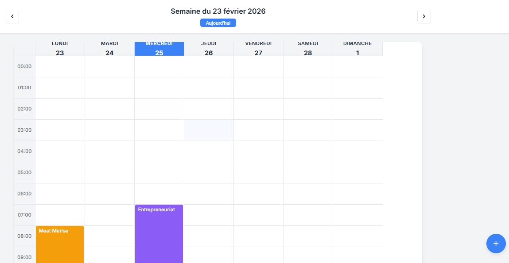

# Weekly_Diary

## Description
Application web permettant de planifier des événements sur une vue hebdomadaire (lundi à dimanche) avec gestion des créneaux horaires.  
Ce projet est le **vingt-troisième** du défi personnel **100 projets en 2026**.

---

## Objectifs du projet
- Générer dynamiquement une semaine complète
- Manipuler les dates et heures en JavaScript
- Structurer des données temporelles
- Implémenter un système CRUD simple
- Concevoir une interface type calendrier

---

## Plateforme
- Web (navigateur)

---

## Technologies utilisées
- HTML
- CSS (Grid)
- JavaScript (Vanilla)
- LocalStorage

---

## Fonctionnalités
- Affichage de la semaine en cours (lundi → dimanche)
- Navigation semaine précédente / suivante
- Ajout d’un événement (titre + jour + heure)
- Affichage des événements dans la grille horaire
- Suppression d’un événement
- Sauvegarde locale des données

---

## Design & UX
- Mise en page en grille (jours en colonnes, heures en lignes)
- Navigation claire en haut de page
- Blocs d’événements lisibles et organisés
- Interface minimaliste et professionnelle
- Responsive (mobile et desktop)

---

## Captures d’écran

---

## Ce que j’ai appris
- Manipulation avancée de l’objet `Date`
- Génération dynamique d’interfaces complexes
- Structuration de données temporelles
- Gestion d’un mini système CRUD
- Organisation du code pour projet structuré

---

## Améliorations possibles
- Édition d’un événement
- Drag & drop
- Couleurs par catégorie
- Vue “Aujourd’hui”
- Vue mensuelle

---

## Statut du projet
 **Projet terminé**